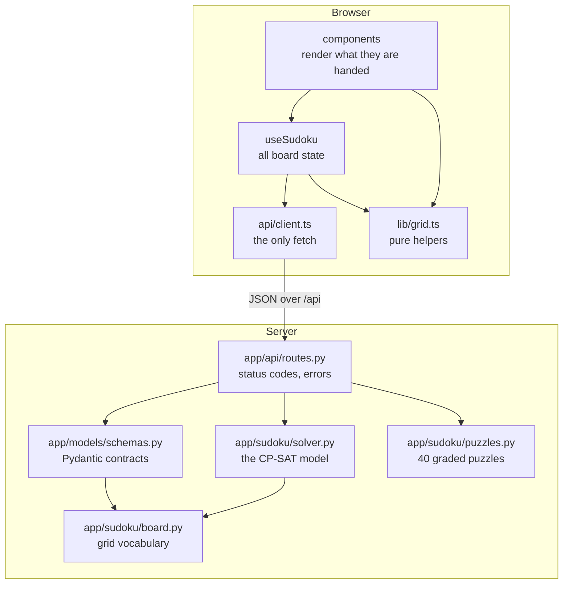
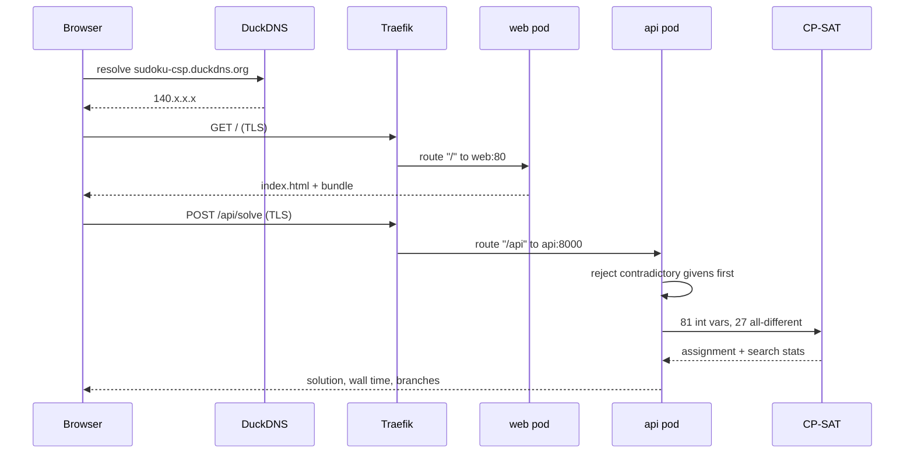
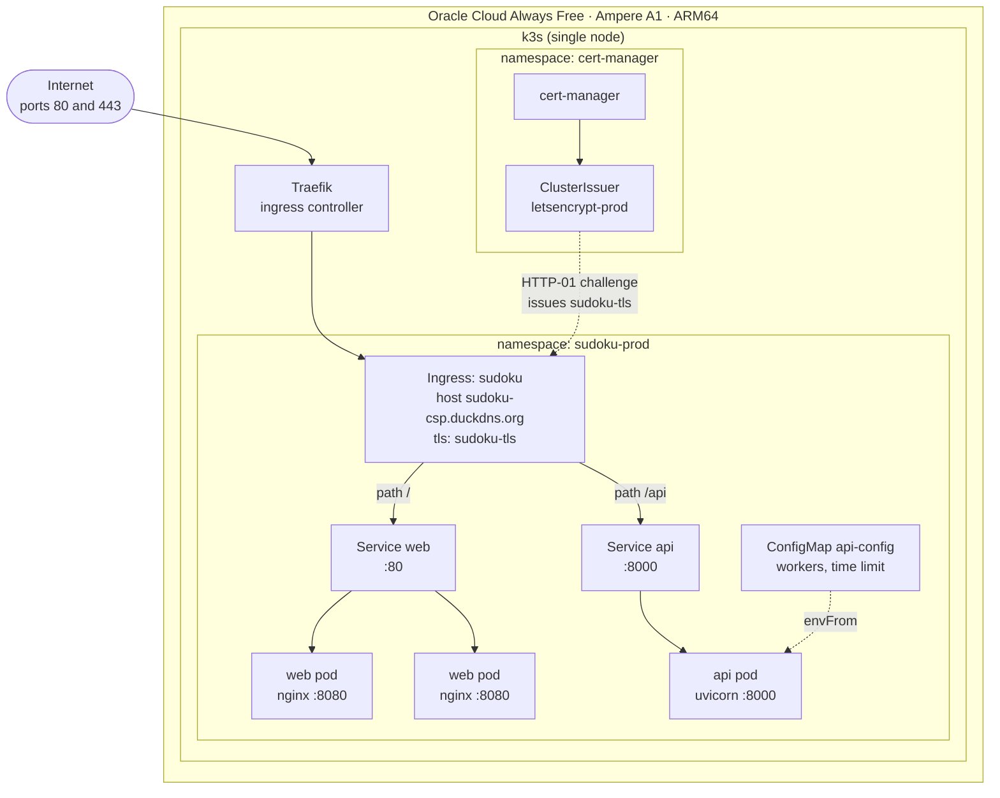
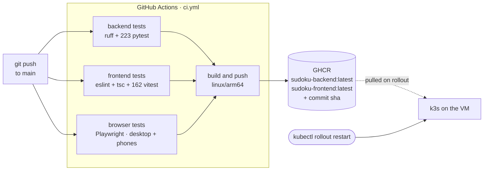

# Architecture

How the Sudoku solver is built, shipped and hosted — and why every line of the
hosting bill is zero.

Live at **[sudoku-csp.duckdns.org](https://sudoku-csp.duckdns.org/)**, running
on one Oracle Cloud Always Free ARM VM.

---

## The shape of it

Three pieces, each with one job:

| Piece | Job | Runs as |
|---|---|---|
| Solver | State Sudoku as 27 all-different constraints, hand it to CP-SAT | Python module, no HTTP |
| API | Translate JSON to grids and back, own the status codes | FastAPI on uvicorn |
| Board | Let a person type a puzzle and watch it solve | React SPA served by nginx |

The dependency arrows only ever point one way. `app/sudoku/` knows nothing about
FastAPI and runs on its own — `python -m app.sudoku.solver` solves a puzzle per
level with no server involved. The front end mirrors it: `lib/grid.ts` is pure,
`api/client.ts` is the only module that calls `fetch`, `hooks/useSudoku.ts` owns
every piece of state, and components render what they are handed.



A grid is always a 9×9 array of integers with `0` for an empty cell, in every
layer and over the wire. The 81-character string form is an input convenience,
not a second model.

---

## How a request is served

One origin, always. The browser never makes a cross-origin request, so CORS
never enters into it — in development the Vite dev server proxies `/api` to
uvicorn, and in production the ingress splits the paths. Same contract, two
mechanisms.



Two details worth knowing. Contradictory givens are caught *before* the solver
runs, so the API can say `r1c5=6 repeats in its row` instead of shrugging with
"no solution". And the solve handlers are plain `def`, not `async def` — CP-SAT
is blocking CPU work, and FastAPI runs sync handlers in a worker thread instead
of stalling the event loop.

---

## What runs on the VM

A single-node k3s cluster. k3s bundles Traefik as its ingress controller, so
there is nothing to install for routing; cert-manager is the one addition.



### Why the ingress splits the paths

Everything could enter through the web pod, which already proxies `/api` onward
for the compose setup. Splitting at the ingress instead means the API scales
independently of the static server and there is no extra hop — and the browser
still sees one origin either way.

### Why the web pod is the one with two replicas

The solver is the expensive half and the node is small, so `api` runs one
replica with room to use it. The static server costs 25 millicores, so it runs
two — enough that an update rolls without a gap.

| Workload | Replicas | CPU request → limit | Memory request → limit |
|---|---|---|---|
| `api` | 1 | 200m → 1 | 256Mi → 640Mi |
| `web` | 2 | 25m → 200m | 32Mi → 128Mi |

`SUDOKU_SOLVER_WORKERS` is set to **2** — at or below the pod's CPU limit on
purpose. CP-SAT will happily start eight search workers on a one-core pod and
spend the time context-switching.

### Hardening

Both images run as a non-root user with a read-only root filesystem, which
means the writable paths have to be declared:

- `api` gets an `emptyDir` at `/tmp`
- `web` gets three — `/etc/nginx/conf.d` (the entrypoint renders its config
  template into it at startup), `/var/cache/nginx`, and `/run` for the pid file

That last one has to be `/run`, not the `/var/run` symlink that points at it.
Mounting the symlink's path replaces it with a directory and nginx then writes
its pid to a read-only root.

---

## How code gets there

Nothing is pushed *to* the VM. The VM pulls. Images are the only thing that
travels, and the cluster reaches out to GHCR over 443.



**A red test never reaches the registry.** The build job declares
`needs: [backend, frontend, e2e]`, so it does not start until every suite
passes, the browser tests included.
Pull requests run the tests and publish nothing.

**Images must be `linux/arm64`.** The free Ampere VM is ARM; an amd64 image
crash-loops there with `exec format error`. The backend sits on
`python:3.13-slim` rather than Alpine so the OR-Tools aarch64 wheel installs as
a binary instead of trying to compile. The frontend's Node stage is pinned to
`$BUILDPLATFORM`, so the bundle is built natively on the x86 runner and only
the small nginx stage is emulated.

**The rollout is manual.** The tag stays `latest`, so the Deployment spec is
unchanged and Kubernetes has no reason to pull again:

```bash
kubectl -n sudoku-prod rollout restart deploy/api deploy/web
```

Each build is also tagged with its commit SHA, so a bad deploy can be pinned
back to a known-good image.

---

## The cost

Every component sits inside a tier that is free indefinitely, not a trial and
not a credit that expires.

| Component | Provider | Tier | Cost |
|---|---|---|---|
| Compute — the whole cluster | Oracle Cloud | Always Free Ampere A1 | **$0** |
| Block storage | Oracle Cloud | Always Free boot volume | **$0** |
| Kubernetes | k3s | Open source, self-hosted | **$0** |
| Ingress controller | Traefik | Bundled with k3s | **$0** |
| Container registry | GitHub Container Registry | Free for public packages | **$0** |
| CI minutes | GitHub Actions | Unlimited for public repositories | **$0** |
| Hostname | DuckDNS | Free subdomain | **$0** |
| TLS certificate | Let's Encrypt via cert-manager | Free, auto-renewing | **$0** |
| | | **Total** | **$0 / month** |

### What makes each one actually free

- **Oracle's Ampere allocation is "Always Free"**, not a 30-day trial. It is
  the only tier generous enough to run a real cluster — which is why the
  ARM constraint runs through every build decision in this repo.
- **The repository is public**, so GHCR packages can be public and Actions
  minutes are unmetered. That is also why no `imagePullSecrets` appears
  anywhere in `deploy/k8s` — an anonymous pull is all the cluster needs.
- **The app is stateless.** No database, no PVC, no backups. The puzzle library
  is a Python module and a solve holds nothing between requests. A Postgres
  StatefulSet would have meant a persistent volume and a real operational
  burden for a solver that has nothing to persist.
- **cert-manager renews on its own**, so TLS never becomes a recurring task or
  a recurring charge.

### What would start costing money

- A managed control plane. GKE covers one zonal control plane on its free tier
  but not the worker nodes; AKS and EKS bill the nodes too.
- Outgrowing Oracle's egress allowance, which a solver serving a 235 KB bundle
  is in no danger of.
- Making the repository private — GHCR would then need a pull secret and
  Actions minutes would be metered.
- Adding a database. This is the change that would end the zero-cost story
  fastest, and the reason the app has stayed stateless.

---

## What is deliberately not here

- **No HTTP→HTTPS redirect yet.** Port 80 serves the app in plaintext; the
  certificate works, but nothing forces the upgrade.
- **No GitOps.** A push builds images; a human runs the rollout. Argo CD or
  Flux would close that loop, and both would still be free.
- **No horizontal autoscaler, no pod disruption budget.** One node makes both
  of them theatre.
- **No observability stack.** `kubectl logs` and `kubectl get events` are the
  whole toolkit. Prometheus and Grafana would fit the free RAM budget, but
  nothing here has needed them yet.

---

## Where to look next

| Question | File |
|---|---|
| How the constraints are stated | [`backend/app/sudoku/solver.py`](backend/app/sudoku/solver.py) |
| What the API promises | [`backend/app/models/schemas.py`](backend/app/models/schemas.py) |
| What differs per environment | [`deploy/k8s/overlays/`](deploy/k8s/overlays/) |
| How images get built | [`.github/workflows/ci.yml`](.github/workflows/ci.yml) |
| How to stand this up yourself | [README — One-time setup](README.md#one-time-setup) |
